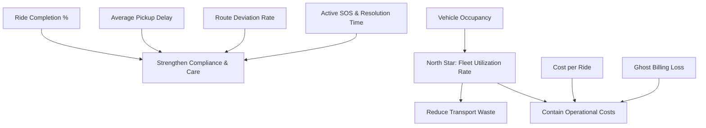

# CorpRide Command Center: KPI Tree & Business Alignment

This document outlines the metric framework for the CorpRide Command Center. It maps each Key Performance Indicator (KPI) to its mathematical definition, the operational scenarios it evaluates, and the high-level business objective it supports.

---

## Metric Hierarchy & Alignment

---

## Detailed KPI Definitions

### 1. North Star KPI: Fleet Utilization Rate
*   **Business Objective:** Reduce Transport Waste & Contain Operational Costs.
*   **Formula:**
    $$\text{Fleet Utilization Rate} = \frac{\sum (\text{Actual Passengers on a Trip})}{\sum (\text{Total Vehicle Seating Capacity})} \times 100\%$$
*   **Target Persona:** Executive Leadership, Operations.
*   **Operational Validation:** Underperforming runs (midday low occupancy) flag fleet allocation inefficiencies.

### 2. Cost per Ride
*   **Business Objective:** Contain Operational Costs.
*   **Formula:**
    $$\text{Cost per Ride} = \frac{\sum (\text{Invoice Amount of Completed Rides})}{\text{Total Completed Rides}}$$
*   **Target Persona:** Executive Leadership, Finance.
*   **Operational Validation:** Provides baseline cost trends to compare across departments and offices.

### 3. Ghost Billing Losses
*   **Business Objective:** Contain Operational Costs & Audit Billing Leakage.
*   **Formula:**
    $$\text{Ghost Billing Losses} = \sum (\text{Invoice Amount for Rides that were Cancelled or Missing Ride Logs})$$
*   **Target Persona:** Finance.
*   **Operational Validation:** Directly highlights vendor billing discrepancies and overcharges.

### 4. Ride Completion %
*   **Business Objective:** Strengthen Service Reliability & Productivity.
*   **Formula:**
    $$\text{Ride Completion \%} = \frac{\text{Total Completed Trips}}{\text{Total Booked Trips}} \times 100\%$$
*   **Target Persona:** Operations.
*   **Operational Validation:** Measures service reliability, especially during peak congestion windows.

### 5. Average Pickup Delay
*   **Business Objective:** Employee Productivity & Service Quality.
*   **Formula:**
    $$\text{Average Pickup Delay} = \frac{\sum (\text{Actual Pickup Time} - \text{Scheduled Pickup Time in Minutes})}{\text{Total Completed Trips}}$$
*   **Target Persona:** Operations, HR & Safety.
*   **Operational Validation:** Monitors driver punctuality and route congestion impact.

### 6. Route Deviation Rate
*   **Business Objective:** Strengthen Compliance, Care, and Security.
*   **Formula:**
    $$\text{Route Deviation Rate} = \frac{\text{Trips with GPS Deviation = True}}{\text{Total Completed Trips}} \times 100\%$$
*   **Target Persona:** HR & Safety, Operations.
*   **Operational Validation:** Detects drivers departing from corporate geofenced paths.

### 7. Active SOS & Resolution SLA
*   **Business Objective:** Enforce Employee Duty of Care.
*   **Formulas:**
    *   `Active SOS Count` = Count of open incidents with `incident_type = 'SOS'` and `status != 'Resolved'`.
    *   `Average SOS Resolution Time` = Average duration (in minutes) between `created_at` and `resolved_at` for resolved SOS incidents.
*   **Target Persona:** HR & Safety.
*   **Operational Validation:** Ensures critical safety events are addressed rapidly by dispatchers.
