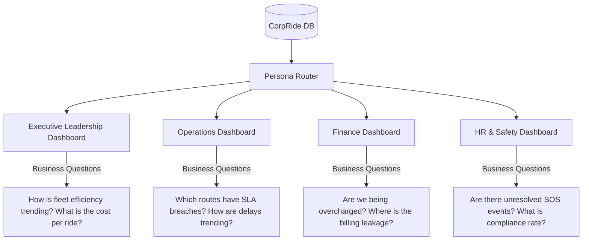

# CorpRide Command Center: Problem Definition & MVP Scope

This document defines the foundational business problem, user roles, core operational scenarios, and MVP boundaries for the **CorpRide Command Center** operations analytics platform.

---

## 1. Executive Summary
CorpRide Command Center is an enterprise operations analytics platform designed to aggregate and visualize employee transportation data. It translates raw operational feeds (booking logs, driver tracking, safety triggers, and vendor invoices) into actionable intelligence for internal stakeholders. The platform focuses on cost containment, duty of care, fleet efficiency, and SLA compliance.

---

## Data Sources
The platform consumes operational data generated by existing enterprise transportation systems, including:
*   Ride Booking Logs
*   Driver Trip Logs
*   GPS Route Records
*   Employee Master Data
*   Vendor Billing Records
*   Attendance Records
*   Incident & SOS Logs

---

## 2. Business Objectives & North Star Metric
The core business objectives are to **reduce transport waste, improve fleet efficiency, and enforce compliance**.

*   **North Star KPI:** **Fleet Utilization Rate**
    *   *Definition:* The percentage of vehicle passenger capacity actually used during operational runs.
    *   *Business Alignment:* Directly drives down "Cost per Ride" and identifies idle resources, aligning with both financial efficiency and environmental sustainability.

---

## 3. Problem Statement
Organizations managing corporate transportation suffer from **fragmented operations** and **delayed visibility**. Admin, finance, and operations teams rely on post-facto spreadsheets provided by vendors, leading to:
*   Unidentified billing errors and duplicate invoicing.
*   Poor service quality (untracked ride delays or unfulfilled bookings during peak hours).
*   SLA breaches that directly affect employee productivity.
*   Delayed response to critical safety events (SOS, major delays).

---

## 4. Stakeholder Personas & Navigation Model
The system uses **persona-based dashboard views** sharing the same underlying data, answering distinct business questions for each group:



### A. Executive Leadership
*   **Role Focus:** Strategic efficiency, overall spend, environmental footprint, and fleet safety standards.
*   **Key Questions:**
    *   What is the trend of the Fleet Utilization Rate month-over-month?
    *   How does the average Cost per Ride compare across different offices and departments?
*   **KPIs:** North Star (Fleet Utilization), Total Cost, Cost per Ride, Overall SLA Compliance.

### B. Operations
*   **Role Focus:** Daily fleet dispatch performance, route optimization, and vendor SLA tracking.
*   **Key Questions:**
    *   Which routes suffer from the worst pickup delays and completion rates?
    *   How does driver performance and vehicle occupancy vary by time window (morning vs. evening)?
*   **KPIs:** SLA Breach %, Ride Completion %, Average Pickup/Drop Delay, Vehicle Occupancy.

### C. Finance
*   **Role Focus:** Auditing invoices, detecting billing leakage, and department-wise cost allocation.
*   **Key Questions:**
    *   How much did we spend on "Ghost Bills" (rides invoiced but never completed)?
    *   What is the cost variance between contracted rates and actual vendor invoices?
*   **KPIs:** Ghost Billing Losses, Invoice Cost Variance, Department Cost Breakdown.

### D. HR & Safety
*   **Role Focus:** Employee duty of care, safety response, and incident escalation.
*   **Key Questions:**
    *   How many active safety incidents (SOS triggers) are open, and what is the average resolution time?
    *   Which routes exhibit consistent safety policy deviations?
*   **KPIs:** Active SOS Events, Incident Resolution Time, Monitored Route Deviation Rate.

---

## 5. Business Assumptions
Since enterprise transportation datasets are not publicly available, the project simulates realistic business operations using synthetic data. The generated dataset intentionally embeds operational scenarios such as billing leakage, congestion, fleet underutilization, and safety incidents to validate analytics and dashboard capabilities.

---

## 6. Core Operational Scenarios
To validate the analytics capability, the system models four realistic enterprise operational scenarios:

### Scenario A: Ghost Billing (Finance/Audit)
*   **Definition:** Vendor invoices contain billable records for rides that were canceled, duplicate logs, or trips never recorded in the driver's GPS log.
*   **Analytics Validation:** SQL logic must flag discrepancies where `Invoice Status = 'Billed'` but corresponding `Ride Log` shows `Status = 'Cancelled'` or is completely missing.

### Scenario B: Peak Hour Congestion (Operations)
*   **Definition:** High commute volumes (08:00–10:00 and 17:00–19:00) cause significant pickup delays, drop delays, and reduced ride completion rates.
*   **Analytics Validation:** Time-series analysis showing degradation in pickup delay and completion rates during rush hour windows.

### Scenario C: Fleet Underutilization (Leadership/Operations)
*   **Definition:** Large vehicles (e.g., 12-seater shuttles) run with low occupancy or sit idle, especially during midday off-peak hours.
*   **Analytics Validation:** Identifying runs where average vehicle occupancy falls below 30%.

### Scenario D: Safety Incident Escalation (HR & Safety)
*   **Definition:** Emergency events (SOS triggers) or severe delays on a route require real-time flagging, dispatch contact, and structured resolution logs.
*   **Analytics Validation:** Tracking SOS logs from creation to close-out, measuring resolution SLA.

---

## 7. Monitored Metrics
These metrics do not require standalone dashboard sections but are monitored components across all pages:
*   **Route Deviation:** Flagged when GPS track deviates from the approved geofenced route.
*   **Pickup/Drop Delays:** Duration in minutes between scheduled times and actual check-ins.

---

## 8. MVP Scope & Boundaries
```
┌───────────────────────────────────────┐   ┌───────────────────────────────────────┐
│              IN SCOPE                 │   │             OUT OF SCOPE              │
├───────────────────────────────────────┤   ├───────────────────────────────────────┤
│ • Interactive Streamlit Dashboard     │   │ • Real-time consumer ride booking     │
│ • Persona-based views & navigation    │   │ • Driver navigation/GPS UI            │
│ • Plotly visualizations & SQL logic   │   │ • Live vehicle tracking on maps       │
│ • SQL-based KPI computation and       │   │ • Payment Gateway integrations        │
│   business analytics                  │   │ • Public-facing authentication portal │
│ • Synthetic data generator            │   └───────────────────────────────────────┘
│ • SQLAlchemy & MySQL database         │
│   connection                          │
└───────────────────────────────────────┘
```
